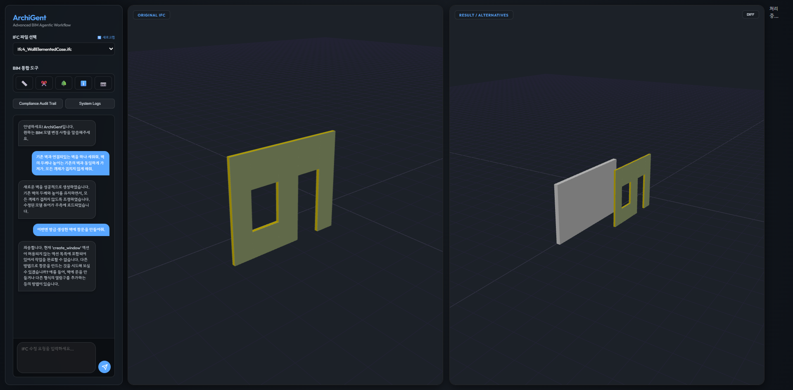
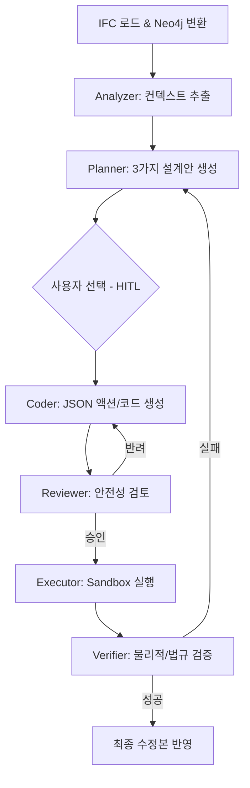

# ArchiGent: Next-Generation Agentic BIM Workflow

**ArchiGent**는 복잡한 BIM(Building Information Modeling) 데이터 표준인 **IFC(Industry Foundation Classes)** 파일을 자연어 지시만으로 분석, 검색, 수정할 수 있도록 설계된 **AI 에이전틱 워크플로우(Agentic Workflow)** 시스템입니다.

건축 도메인의 전문 지식과 최신 LLM의 추론 능력을 결합하여, 코딩 지식 없이도 건축 모델을 자유롭게 제어할 수 있는 지능형 인터페이스를 제공합니다.


---

## 시스템 아키텍처

ArchiGent는 **FastAPI**를 서버 엔진으로, **LangGraph**를 워크플로우 오케스트레이터로 사용합니다. BIM 데이터를 **Neo4j** 그래프 데이터베이스로 변환하여 LLM이 복잡한 건축 관계를 정확히 이해하고 제어할 수 있도록 설계되었습니다.

### **전체 워크플로우 (Multi-Design Visual HITL)**



---

## 에이전트별 역할

1.  **Analyzer Agent (`analyzer_agent.py`)**
    *   사용자의 자연어 요청을 해석하여 최적의 **Cypher 쿼리**를 자동 생성합니다.
    *   Neo4j에서 타겟 객체와 주변 맥락, 관련 건축 법규(`regulations/`) 정보를 추출합니다.
2.  **Planner Agent (`planner_agent.py`)**
    *   분석 결과에 따라 **3가지 서로 다른 수치·위치·방향을 가진 설계 시안**을 제안합니다.
    *   사용자의 선택을 기다리는 Interrupt(Human-in-the-loop) 지점을 관리합니다.
3.  **Coder Agent (`coder_agent.py`)**
    *   확정된 설계안을 바탕으로 `IfcOpenShell`을 제어하기 위한 **JSON 액션 리스트** 또는 Python 코드를 생성합니다.
4.  **Reviewer Agent (`reviewer_agent.py`)**
    *   생성된 코드/액션의 문법 오류, 논리적 허점, 원래 계획과의 일치 여부를 검토합니다.
5.  **Verifier Agent (`verifier_agent/`)**
    *   **물리적 검증**: 수정 전/후 파일 비교를 통해 실제 변경 사항을 확인합니다.
    *   **법규 검증**: 최소 면적, 높이 등 건축 법규 준수 여부를 최종 판별합니다.

---

## 기술 스택

| 구분 | 기술 요소 | 비고 |
| :--- | :--- | :--- |
| **LLM** | **Qwen 30B (Local)** | 고속 추론 및 대규모 컨텍스트 처리 |
| **Workflow** | **LangGraph** | 상태 기반 멀티 에이전트 오케스트레이션 |
| **Database** | **Neo4j** | IFC 객체 관계망 구조화 및 고속 검색 |
| **BIM Kernel** | **IfcOpenShell** | IFC 2x3/4/4x3 표준 처리 및 수정 |
| **API Server** | **FastAPI** | 비동기 작업 및 실시간 로그 스트리밍 |

---

## 프로젝트 구조

*   `main.py`: 전체 에이전트 그래프(LangGraph) 정의 및 엔트리 포인트
*   `server.py`: FastAPI 기반 웹 서버 및 상태 관리
*   `bim_actions.py` / `bim_util.py`: IFC 조작 핵심 로직 및 유틸리티
*   `db/`: IFC 데이터를 Neo4j로 변환 및 관리하는 로직
*   `regulations/`: RAG에 활용되는 건축 법규 데이터
*   `backups/ / modified/`: 수정 전/후 파일 및 히스토리 관리

---

## 실행 방법 (How to Run)

### 1. 환경 설정
*   `.env.example` 파일을 복사하여 `.env` 파일을 생성합니다.
*   `.env` 파일 내의 `NEO4J`, `VLLM_MODEL_PATH` 등 환경에 맞는 설정값을 입력합니다.
```bash
cp .env.example .env
```

### 2. 의존성 설치
```bash
pip install -r requirements.txt
```

### 3. 서버 시작
두 개의 터미널에서 각각 아래 스크립트를 실행합니다.

*   **모델 서버 (vLLM) 시작**:
    ```bash
    ./start_llm.sh
    ```
*   **아키전트 웹 서버 시작**:
    ```bash
    ./start_web.sh
    ```

---

## 사용 방법 (Visual Guide)

1. **IFC 로드**: 브라우저에서 `http://localhost:8001` 접속 후 `raw/` 폴더에서 파일을 선택해 로드합니다.
2. **자연어 요청**: 채팅창에 요청 사항(예: "복도 끝에 벽을 하나 세워줘")을 입력합니다.
3. **시안 비교 (Preview)**: 화면 아래 나타나는 **시안 1, 2, 3** 카드에서 `미리보기`를 클릭해 우측 뷰어로 결과를 확인합니다.
4. **파라미터 조정**: 선택한 시안의 카드에서 **벽 두께(mm)**와 **높이(mm)**를 원하는 값으로 수정합니다.
5. **최종 승인**: `이 시안으로 승인 및 정밀 조정` 버튼을 눌러 작업을 마무리합니다.

---

## 기술 사항 (Notes)
- **법규 검토**: 건축 법규(안전, 피난 등)는 사용자가 요청하지 않아도 항상 검토 과정에 포함됩니다.
- **리소스 최적화**: 모델 추론 성능 향상을 위해 분산 추론 환경 설정을 권장합니다.
- **의존성**: `ifcopenshell`의 기하학 연산은 내부 유틸리티를 기반으로 수행됩니다.